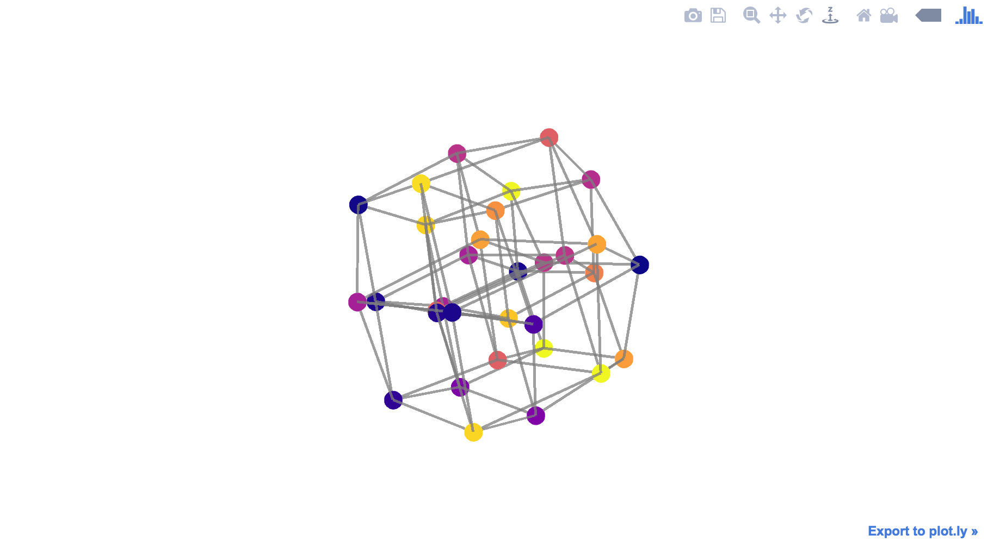

# Genotype-phenotype map visualizations powered by Plotly

Plot a GenotypePhenotypeMap object from the `gpmap` API as an interactive, 3d network.

## Example

```python

# Use the gpmap library to simulate a genotype-phenotype map
from gpmap.simulate import GenotypePhenotypeSimulation

gpm = GenotypePhenotypeSimulation.from_length(5)
G = gpm.add_networkx()
edges = list(G.edges())

# Draw a 3d network using plotly
import plotly
import gpm_plotly

# Prepart a Jupyter notebook for plotly offline
plotly.offline.init_notebook_mode(connected=True)

# Use gpm_plotly to build network JSON
json = gpm_plotly.draw(gpm, list(G.edges()),
    edge_widths=5,
    edge_opacity=.5,
)
# Plot inside a Jupyter notebook
plotly.offline.iplot(json)

```


